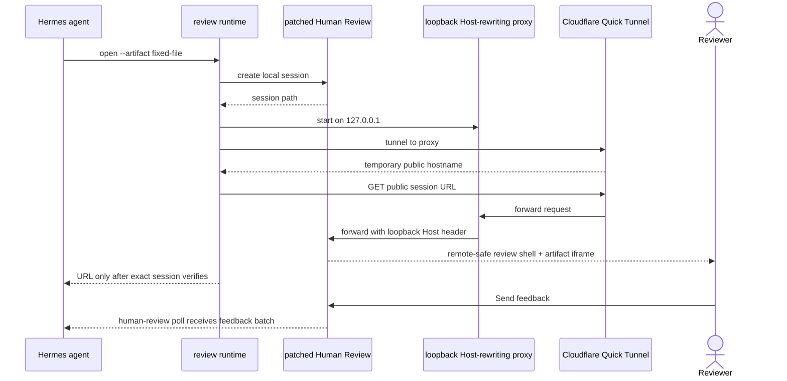
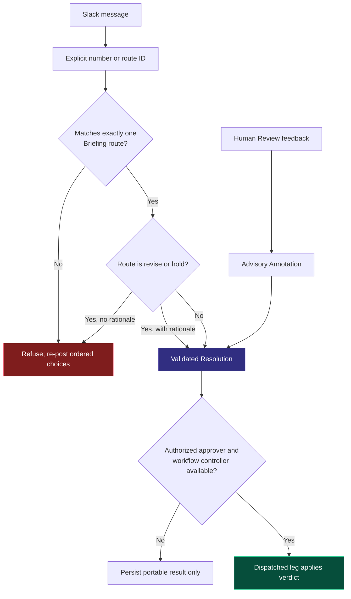
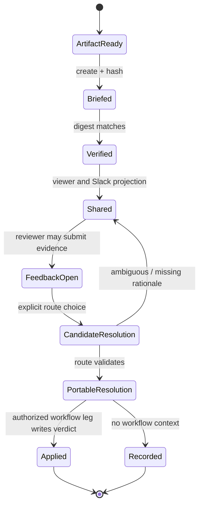
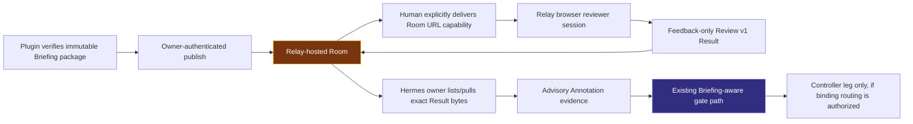

# Architecture

This document explains why the Subspace Review & Gate plugin can project one fixed artifact into Human Review and Slack without creating competing workflow authorities. It describes the current implementation, not a deployment promise. The portable review contract is [Subspace Review & Gate v1](https://github.com/spacedock-dev/subspace-v0/blob/5e4a5f5cb7ce9521a3cc451aa9ec30ea4e6f1ddb/docs/review-and-gate.md); where this document conflicts with that contract, the contract wins.

## 1. Design rule: one portable contract, several adapters

The immutable Subspace v1 Briefing is the canonical transport object. Its artifact URI, media type, raw-byte SHA-256 revision, question, criteria, and ordered routes are fixed before review is shared.

Human Review and Slack are deliberately projections of that object:

- **Human Review** is the detail-feedback plane: anchored comments, edits, and an overall note.
- **Slack** is the compact gate-input plane: a visible question and ordered route selection.
- **The workflow controller / dispatched leg** is the only writer that can apply a binding verdict to a Spacedock workflow.

```mermaid
flowchart LR
    A[Fixed local artifact] --> H[Raw-byte SHA-256]
    H --> B[Immutable Subspace v1 Briefing]

    B --> HR[Human Review projection]
    HR --> FE[Feedback batch<br/>comments / edits / note]

    B --> SL[Slack gate projection]
    SL --> CR[Explicit route selection<br/>number / route ID]

    FE --> AN[Advisory Annotation evidence]
    CR --> VR[Briefing-aware Resolution builder]
    AN --> VR
    B --> VR

    VR --> R[Portable Annotation + Resolution]
    R --> Q{Workflow context?}
    Q -->|Standalone artifact| S[Persist outcome beside Briefing]
    Q -->|Spacedock entity| L[Authorized controller / workflow leg]
    L --> V[Binding verdict and routing]

    style B fill:#312e81,stroke:#a78bfa,color:#fff
    style HR fill:#083344,stroke:#22d3ee,color:#fff
    style SL fill:#4c1d95,stroke:#c4b5fd,color:#fff
    style L fill:#064e3b,stroke:#34d399,color:#fff
```



The arrows matter: Human Review does not point directly to a verdict. Slack does not point directly to a verdict. Both feed evidence or a candidate choice into validation against the immutable Briefing.

## 2. Artifact identity prevents a review from drifting

A reviewer must be reviewing the artifact that the gate describes. The plugin hashes the raw artifact bytes and writes the digest into the Briefing. The digest is checked again immediately before sharing.

```mermaid
sequenceDiagram
    actor Author
    participant Plugin as Hermes plugin
    participant B as Briefing file
    participant Viewer as Human Review
    participant Slack

    Author->>Plugin: create artifact review
    Plugin->>Plugin: read raw bytes; compute SHA-256
    Plugin->>B: write immutable Briefing (URI, sha256, routes)
    Plugin->>Plugin: verify raw bytes == Briefing revision
    Plugin->>Viewer: project the verified artifact
    Plugin->>Slack: render same Briefing question and routes

    Note over B,Slack: Artifact bytes, question, or route changes<br/>require a new Briefing—not an overwrite.
```

This works because the digest has one narrow meaning: it fixes artifact bytes. It is not a claim that a reviewer agrees, that a URL is secure, or that a workflow advanced.

## 3. Public Human Review projection

The optional runtime turns a local Human Review session into a temporary public HTTPS review surface. It is intentionally separate from the Briefing and workflow writer.



### Why the proxy and patched viewer exist

Human Review's local server has a Host defense: it accepts loopback Host headers. The proxy receives public traffic and forwards it upstream with that loopback Host header, preserving the defense rather than exposing the local server directly.

The upstream viewer assumed a browser was running on the same machine, and could send a non-loopback reviewer’s artifact iframe to `127.0.0.1`. The patched fork retains a reachable proxied origin for remote viewers while preserving the local alternate-loopback behavior. Without this patch, an HTTP 200 shell can still contain an unusable artifact iframe.

### What public verification proves

The runtime checks that the public URL returns the expected session shell before showing it. A real feedback batch received by `human-review poll` proves the complete reviewer path: render, submit, and receive.

A Quick Tunnel remains a public unauthenticated capability URL. Its verification proves reachability, not authorization. Sensitive or durable reviews require a named Cloudflare Tunnel protected by Cloudflare Access.

## 4. Gate semantics remain separate from feedback

Feedback often explains *why* a route should be chosen. It does not choose or apply that route. The candidate Resolution builder maps an explicit selection to the exact ordered route in the Briefing and preserves the target/destination. `revise` and `hold` require rationale.



This prevents four common errors:

1. A comment or emoji cannot silently advance work.
2. Two routes that share the word `approve` cannot be conflated; route ID and destination survive.
3. A review UI cannot become a second workflow state database.
4. A standalone artifact can still have a portable outcome without inventing a Spacedock transition.

## 5. Lifecycle and ownership



Only `Applied` changes a Spacedock workflow, and only when an authorized controller/leg actually writes it. `Recorded` is a valid terminal state for independent artifacts. `Shared` does not mean approved, and `FeedbackOpen` does not mean a decision exists.

## 6. Runtime state and recovery

The public-review runtime stores only operational state under `$HERMES_HOME/subspace-review-gate/public-review.json`: artifact path, session path, public URL, PIDs, and log paths. It is not the review contract and must not contain credentials.

If the proxy/tunnel dies, the public URL is no longer a valid review surface. The agent must check status, close stale state, create a new session, re-verify, and publish a new URL. It must not claim a memory-resident Human Review session persists after the server has discarded it.

## 7. Relay-hosted Room boundary

[Subspace Relay](https://github.com/spacedock-dev/subspace-relay) is the hosted
transport/application layer for a bounded browser Review Room. This plugin is the
**Hermes owner client**: it verifies and publishes immutable package bytes, keeps the
owner-device receipt private, creates/disables a Room, revokes an arrived session, and
lists/pulls feedback evidence. It does not host a browser, mint browser sessions, issue
credentials to a reviewer, or produce a binding Resolution.



The **Room URL capability** is deliberately outside the tool output and automatic agent
delivery paths. Owner feedback has two separate projections over the same validated Result:
`relay_results` returns structural metadata only to the agent, while `relay_owner_inbox`
writes a private local human-facing HTML snapshot containing escaped reviewer labels and
feedback. The snapshot is not a server and does not enable reviewer-to-reviewer sharing.
Relay results remain advisory evidence: the plugin validates bytes and computes local
digests, but never maps them to a verdict. Local Human Review remains an optional
separate surface when Relay/network access is not appropriate; it is not a fallback Relay
host.
